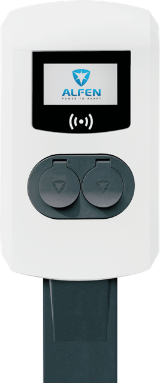
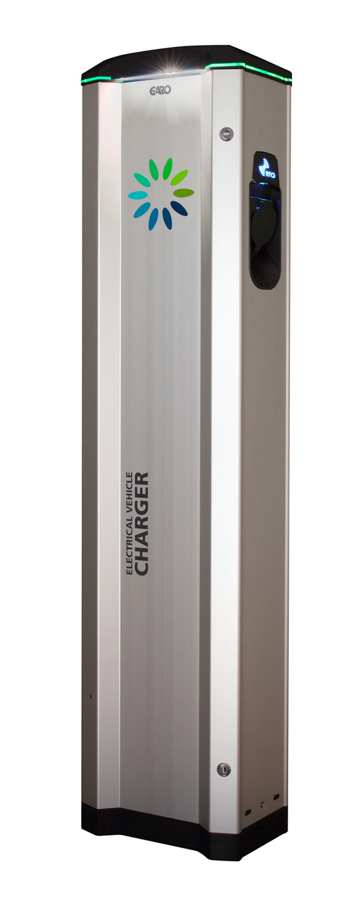

# Innehåll

På denna sida sammanfattas hur våra elbilsladdare nyttjas och fungerar.

[TOC]

# Hur får jag tillgång att ladda?

Om du önskar ladda på samfällighetens stolpar behöver du göra följande:

1. **Skaffa parkeringstillstånd**. Se sidan [Parkeringstillstånd](./parkering.md#parkeringstillstand)
2. **Få tillgång till laddning**. Laddstolparna tillhandahålls av [Mer](https://se.mer.eco/). Skaffa ett konto, antingen via webben eller appen, och be [kundtjänst](https://se.mer.eco/mer/kontakta-oss/) att registrera dig på samfällighetens stolpar.

# Våra laddare

Samfälligheten har i skrivande stund 3 laddstolpar med två uttag i varje. Två vita Alfen-laddare samt en blå, LS4.

## Vita stolparna (Alfen Eve Double Pro-Line)

{ align=left width=100 }

De två vita laddarna (ID: 22052 och 22053), av märket Alfen Eve Double Pro-line, delar på en 32A-säkring (22kW, 3-fas, 400V). Dvs fyra uttag delar på tre faser om 32A. Lastbalanserare fördelar strömmen automatiskt mellan laddarna.

Varje enskilt uttag kan leverera en effekt upp till 11kW.

> ℹ️ Om alla uttag används kommer hastigheten behöva begränsas. Se [exempel](#exempel-effektfordelning-nar-flera-laddar-samtidigt) nedan.

> ℹ️ 1-fasbilar (som t.ex. laddhybrider) laddar på endast en fas och kan därför bara använda ca ⅓ av den totala effekten.

## Blå stolpen (Garo LS4)

{ align=left width=100}

Den blå LS4-laddaren är en 1-fasladdare avsäkrad med 32A.

> ℹ️ Eftersom endast en fas nyttjas gäller samma kapacitet oavsett bil: Max 3,7kW (230V × 16A) oavsett om bilen har 1- eller 3-fasladdare.

# Allmänt om elbilar

- De flesta elbilar har en ombordladdare som klarar max 16A per fas (max 11kW).
- Bilen själv begränsar laddningen beroende på batteriets status, temperatur, laddnivå m.m.
- Vissa bilar har ombordladdare som laddar på tre faser, vissa endast på en fas. Se [exempel](#exempel-effektfordelning-nar-flera-laddar-samtidigt) nedan för att förstå vad det innebär för effekten vid laddning.
- Även om bilen har en 3-fasladdare ombord kan laddning begränsas till 1 fas om kabeln som används endast har en ledare. Det behövs en ledare per fas. Kollar man kabelns kontakt kan man se om där finns stift till alla faser. Leta efter de tre ledarna, märkta L1, L2, L3 eller dylikt.

# Exempel: Effektfördelning när flera laddar samtidigt

**Exempel 1 – Två 3-fasbilar**

- Strömmen delas lika: 32A / 2 = 16A per uttag
- Effekt per bil: √3 × 400V × 16A ≈ 11 kW
- Båda bilarna laddar med ca 11kW var

**Exempel 2 – En 3-fasbil + en 1-fasbil**

- Strömmen delas lika: 32A / 2 = 16A per uttag
- 1-fasbilen: 230V × 16A ≈ 3,7kW
- 3-fasbilen: √3 × 400V × 16A ≈ 11kW

**Exempel 3 – En ensam bil**

- Max tillåtna belastning gäller: bör vara 16A
- 1-fasbil: 230V × 16A ≈ 3,7kW
- 3-fasbil: √3 × 400V × 16A ≈ 11kW

**Exempel 4 - flera bilar på de två vita laddarna**

Laddare 22052:

| Uttag | Starttid | Erbjuden effekt | Verklig effekt | Typ av bil | Kommentar |
|-------|----------|-----------------|---------------|------------|-----------|
| 1     | 13:00    | 11kW           | 3,6kW        | 1-fas bil  | Färdigladdad när uttag 2 kopplades in |
| 2     | 19:00    | 11kW           | 3,6kW        | 1-fas bil  | Båda uttag fick 16A vid samtidig laddning |

Laddare 22053:

| Uttag | Starttid | Erbjuden effekt | Verklig effekt | Typ av bil | Kommentar |
|-------|----------|-----------------|---------------|------------|-----------|
| 1     | 16:35    | 5,5kW          | 5,4kW        | 3-fas bil  | Delad last med 22052 – totalt 16A till 22053, dvs 8A per uttag |
| 2     | 16:57    | 5,5kW          | 1,8kW        | 1-fas bil  | Lägre effekt på 1-fasbil | 

# Felsökning

För att underlätta framtida felsökning och åtgärd följer nedan några fel som tidigare uppstått och avhjälpts.

## En av de vita laddarna ger alltid lägre effekt än den andra 

Det har hänt att en vit laddare inte kunnat erbjuda full kapacitet. Till exempel har en 1-fasbil inte kommit upp i mer än 1,3kW (6A) på en av de vita Alfen-laddarna, trots att det varit den enda inkopplade bilen (vilket borde gett en effekt på 3,6kW, eller 16A). Andra gånger har en ensam bil inte nått mer än 1,8kW (8A). 

**(Max 6A) Förlorad uppkoppling till lastbalanseraren**

För det första kan det hända att laddaren tappar uppkopplingen till lastbalanseraren. När så sker går laddaren in i ett säkerhetsläge och erbjuder max 6A. 6A på en fas blir ca 1,3kW. På tre faser blir detta ca 4,2kW.

> ✅ Supporten på Mer kan avhjälpa detta på distans, vilket gjordes bland annat 2025-07-10. Hör av er till support, se [kontaktuppgifter](https://se.mer.eco/mer/kontakta-oss/), uppge namnet på samfälligheten och be dem ta en titt så fixar de det lätt.

**(Max 8A) Stolpens inställningar**

För det andra har varje stolpe en inställning som reglerar max tillåtna belastning per uttag. I juli 2025 var denna satt till max 8A på stolpe 22053, men max 16A på stolpe 22052. 8A på en fas blir ca 1,8kW, på tre faser ca 5,5kW. 

> ✅ Supporten på Mer justerade denna inställning 2025-07-23 så att stolpe 22053 erbjöd max 16A istället (1-fas ca 3,6kW, 3-fas ca 11kW). Vid behov, hör av er till support, se [kontaktuppgifter](https://se.mer.eco/mer/kontakta-oss/), uppge namnet på samfälligheten så kan de justera inställningarna på distans.
